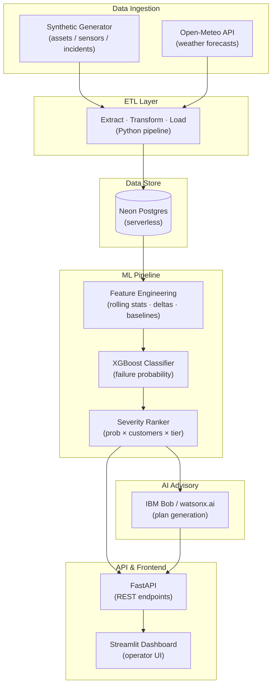

# Architecture: Grid Guard

## System Diagram



---

## Component Table

| Component | Responsibility |
|---|---|
| **Synthetic Generator** | Produces realistic asset, sensor-telemetry, and incident-history records for development and demo |
| **Open-Meteo API** | Provides free, location-keyed multi-day weather forecasts ingested on a scheduled basis |
| **ETL Pipeline** | Cleans, normalises, and loads all source data into Neon Postgres |
| **Neon Postgres** | Shared serverless relational store; single source of truth for all pipeline stages |
| **Feature Engineering** | Computes rolling windows, rate-of-change, and baseline-deviation features from raw sensor rows |
| **XGBoost Classifier** | Produces per-asset failure probability scores; SHAP values provide feature-importance explainability |
| **Severity Ranker** | Weights probability by grid impact (customers served × criticality tier) to produce a ranked asset list |
| **IBM Bob / watsonx.ai** | Generates a prioritised, plain-English maintenance and crew dispatch plan from the ranked asset list |
| **FastAPI** | Stateless REST API; exposes ranked-risk and generated-plan endpoints to the frontend |
| **Streamlit Dashboard** | Operator-facing UI; shows asset risk map, ranked table, and Bob-generated maintenance plan |

---

## End-to-End Data Walkthrough

### 1. Data Ingestion

Two sources feed the pipeline simultaneously.

The **synthetic generator** (`src/data_generation/generate_fake_data.py`) creates a set of grid
assets (transformers, switchgear, line segments), each with a criticality tier and a
customer-served count. For each asset it generates time-series sensor readings —
temperature, vibration, partial discharge, oil quality — with degradation trends and
injected failure events that serve as ground-truth labels for model training.

The **Open-Meteo API** is called for each asset's latitude/longitude. It returns a
multi-day forecast of temperature, wind speed, precipitation, and humidity that is
joined to the asset's sensor records by location and time window.

### 2. ETL

The ETL layer (`src/etl/`) validates incoming records, normalises units,
handles missing values, and writes three tables to Neon Postgres: `assets`,
`sensor_readings`, and `weather_forecasts`. A fourth table, `incidents`, stores
historical outage events that label which assets failed and when.

All writes are idempotent (upsert on primary key) so the pipeline can be re-run
without duplicating data.

### 3. Feature Engineering

A feature-engineering step (`src/feature_engineering/build_features.py`) queries Neon and computes a
wide row per asset per time window. Computed columns include:

- Rolling 24 h / 72 h maximum and mean for each sensor dimension
- Rate of change (Δ per hour) for temperature and vibration
- Deviation from the asset's own 30-day rolling baseline (z-score)
- Upcoming maximum forecast temperature and wind speed for the next 48 h
- Days since last recorded incident on the same asset

These features encode both *current state* and *trajectory*, which the raw sensor
readings alone cannot express.

### 4. XGBoost Model

The model (`src/ml/train_model.py`) is trained on the engineered feature matrix with a binary
label: `1` if the asset failed within the following 7-day window, `0` otherwise.
At inference time it outputs a failure probability in [0, 1] for each asset.

SHAP values are computed for every prediction to identify which features drove the
score for each individual asset. The top contributing features are passed downstream
as part of the asset's risk context.

### 5. Severity Ranking

Each asset's raw failure probability is multiplied by a grid-impact weight:

```
severity = failure_probability × log1p(customers_served) × criticality_tier
```

`log1p` on customer count prevents a single very-large-feeder asset from
arithmetically dominating all others; `criticality_tier` is an integer (1–3) assigned
during asset creation. The ranked list is sorted descending by severity and the top
assets are selected for the advisory step.

### 6. IBM Bob / watsonx.ai Plan Generation

The top-ranked assets — along with their severity score, key SHAP-identified sensor
readings, and upcoming weather context — are serialised into a structured prompt.
IBM Bob (via the watsonx.ai API) generates a prioritised maintenance and crew
pre-positioning plan in plain English. The prompt explicitly instructs Bob to name
each asset, state the basis for its priority, and recommend a specific action (inspect,
replace, pre-stage spares, or shed load). The response text is stored alongside the
ranked list.

### 7. FastAPI

A lightweight FastAPI application (`src/api/main.py`) exposes two endpoints:

| Endpoint | Returns |
|---|---|
| `GET /risk` | Ranked asset list with scores and SHAP context |
| `GET /plan` | Bob-generated plain-English maintenance plan |

The API is stateless — it reads from Neon and returns JSON. There is no session state
or in-memory cache between requests.

### 8. Streamlit Dashboard

The Streamlit frontend (`src/dashboard/`) calls the FastAPI endpoints and renders:

- **Asset risk map** — geographic scatter plot, marker colour driven by severity score
- **Ranked risk table** — sortable table with failure probability, severity, customers
  served, top sensor reading, and 48 h weather outlook per asset
- **Maintenance plan panel** — the Bob-generated plan text displayed with asset
  cross-references highlighted

---

## Scalability Notes

- **Neon Postgres** scales compute automatically on query load and scales to zero when
  idle, making it cost-free between pipeline runs. Switching to a fixed-size managed
  Postgres cluster for production is a one-line connection-string change.
- **FastAPI** is stateless by design. Multiple instances can be run behind a load
  balancer with no shared-state dependencies. Gunicorn + Uvicorn workers are the
  standard production deployment pattern.
- **The ML pipeline** is designed to run as a scheduled batch job (e.g. nightly or
  on-demand). The XGBoost model artefact is written to disk after training and loaded
  at inference time, so scoring does not require re-training on every API request.
- **Streamlit** is appropriate for internal operator tooling at the scale of a utility
  NOC. For higher-concurrency public deployment, the FastAPI layer already provides a
  clean separation that allows the frontend to be replaced without changing the backend.

---

## Security Notes

- All credentials — Neon connection string, watsonx.ai API key, Open-Meteo API key —
  are read from environment variables loaded via a `.env` file using `python-dotenv`.
- No credentials are hardcoded in source files or written to logs.
- The `.env` file is listed in `.gitignore` and is never committed to version control.
- See [`docs/setup-guide.md`](setup-guide.md) for the full list of required
  environment variables and how to populate them.
